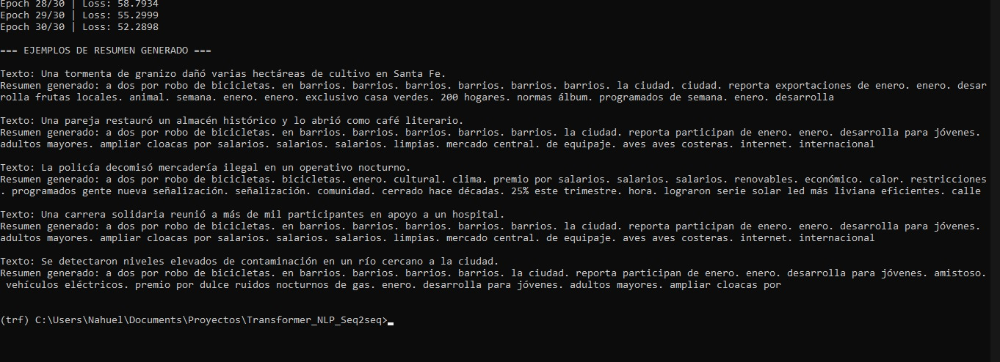
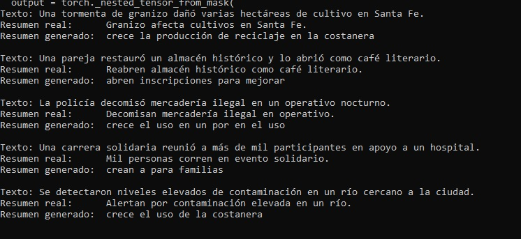
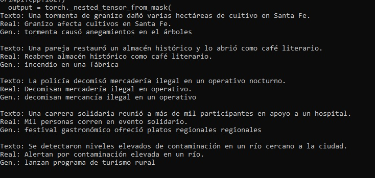
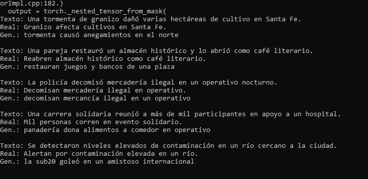

Si bien el motivo de este proyecto es aprender sobre redes transformers, hay que mencionar que se incorpora nuevamente Seq2seq.
Y es que al fin y al cabo debemos pensar a Seq2seq no sólo como un tipo de red neuronal sino también como un patrón de diseño aplicable a otras redes.
Si vemos que en Seq2seq tenemos un encoder y un decoder, podemos integrar diferentes tipos de redes a cada uno, o obtener su output general y trabajarlo en otra red.

Este proyecto también incorpora NLP (Natural Language Processing: Procesamiento del lenguaje natural), lo que nos acerca a tecnologías conocidas como Chat GPT.
Ya quería llegar a este tipo de tecnologías. Básicamente a una entrada, se nos responderá con un texto generado por el aprendizaje neuronal.
Es decir que si diéramos dos veces exactamente la misma entrada, el modelo NLP, aunque en esencia responda lo mismo, lo hará con un lenguaje natural y no dando exactamente las mismas palabras sin cambio alguno.

    "Las aves normalmente cantan de día" o "Las aves suelen cantar en el dia"

Ambas frases tienen el mismo significado, pero no son exactamente las mismas palabras.
De el mismo modo, la salida podrá ser la misma, pero cómo lo diga el lenguaje no. Pues NLP está generando la frase al momento y no simplemente repitiéndola ante un estímulo.
Esta tecnología se usó, si mal no recuerdo, hasta chat GPT 4. Aunque claro, nosotros la usaremos de un modo básico. Con un dataset limitado y el proyecto se basará en intentar generar a partir de un titular, un resumen de ese titular.

    "Titular": "El servicio meteorológico emitió una alerta por vientos fuertes para la costa atlántica.",
    "resumen": "Alertan por vientos fuertes en la costa."

No se si lo mencioné antes, pero el modo que tengo de estudiar mi roadmap en redes neuronales, es simplemente solicitar el código a chat gpt, y simplemente analizarlo hasta el máximo, hasta que ya no me queden dudas. Explicármelo a mí mismo en un texto (Para este caso el README.md) es otra forma de estudio que suelo usar. ¿Pero cuando aprender programación no fue leer código ajeno?

Al momento la red Transformer que pretende realizar los resúmenes, funciona. Genera texto en lenguaje natural, y breve. Pero falla en dar un resumen coherente y acorde al texto que debe resumir.
Quiero decir con esto, que podríamos ya estudiar la red así como está. Pues aunque intento realizar modificaciones que solucionen la incoherencia de las salidas (soluciones que a continuación mencionaré pues son útiles para enfocar como ver un problema relativo a este tipo de trabajos), quizás sea el problema usar datasets del tamaño adecuado para un solo programador, con una sola notebook. Aun así se podrá estudiar teniendo en cuenta esa salvedad.

En la primer ejecución de la red, obtuve esto:

Un espanto, pero en esta ocasión el error estaba en que el modelo esperaba inputs ya tokenizados. Es decir como valores enteros en un batch. Pero en cambio recibía texto.

Corregido ese error obtuve:

Donde claramente se ve una mejora. Aunque no tenía relación con el texto a resumir ni tanta coherencia.
El cambio que me sugería Chat GPT era implementar Attention al modelo LSTM que se usa en seq2seq. Pero yo preferí tomar otro camino y enfocarme en el Transformer. Guarde los pesos entrenados y a cada ejecución siguiente del código, se re-entrenarían sobre esos mismos pesos ya entrenados. Obtuve esto:

Volví a re-entrenar y obtuve:

Y ya ahí vemos como no solo tiene coherencia, sino que realizó correctamente el resumen de algunos titulares, mientras que en otros se acercó al menos. Una belleza.

En definitiva, guardar los pesos guardados, para re-entrenar sobre esos pesos y no una matriz de valores randoms cada vez, es un método a tener en cuenta no solo para este modelo. Sino para cualquier tipo de modelo donde trabajemos con estados H o transformaciones lineales de cualquier tipo.

¿Hasta qué punto podríamos mejorar el trabajo de esta red? Re-entrenando pesos, no lo sé. Otras soluciones como incorporar Attention a LSTM también o expandir el dataset, serían significativas. Pero no es algo en lo que nos vamos a ocupar aquí. Considero que para lo que es aprender que es un Transformer, la red ya está operando a un nivel decente.

Antes de seguir admiremos el progreso que tuvo la red entre entrenamiento y entrenamiento. A mi personalmente me recordó un viejo pensamiento que tuve incluso antes de conocer Chat GPT. El lenguaje humano, separado de entendimientos más profundos (que abre caminos a usos del lenguaje como la poesía o lenguajes lógicos), puede ser llevado en su forma básica de estímulo, respuesta, a álgebras y estadísticas. Verlo llevado a un código que lo demuestra no deja de impactarme. Que un niño aprenda que ante la palabra "hambre" puede recibir comida, es más o menos lo que esta red realiza (pensamientos de alguien que viaja en colectivo :P ). Con más recursos podríamos crear nuestro Chat GPT.
Bueno, aun no me hecho flores, vamos a ver como funciona esto...

<h2>Estructura</h2>

DEVICE = torch.device("cuda" if torch.cuda.is_available() else "cpu") 
MAX_SRC_LEN = 128 
MAX_TGT_LEN = 40 
BATCH_SIZE = 16 
EPOCHS = 12 
LR = 3e-4 
D_MODEL = 128 
NHEAD = 4 
NUM_ENCODER_LAYERS = 3 
NUM_DECODER_LAYERS = 3 
DIM_FF = 512 
DROPOUT = 0.1 
MODEL_PATH = "transformer_summarizer.pt" 

<h2>Main</h2>

Una vez escuche decir a alguien de sistemas que lo mejor para aprender una nueva tecnología, es ver que problema vino a solucionar la misma. Y es sabio pensar así, porque ninguna tecnología se abre paso si no es realmente necesitada.
RNN, LSTM, Seq2seq tienen una memoria, si, pero comparada con Transformer, el paso fue gigante y permitió que secuencias más largas, como por ejemplo un texto más largo que "hola mundo", fueran comprendidas por la red neuronal en cuestión.
Y con comprendidas me refiero a que al igual que Chat GPT, si diéramos un texto de entrada con varios contextos, sujetos, verbos, Transformer sabría exactamente a qué prestar más atención, entendiendo el contexto y el mensaje real tras un texto largo.

Mirando la frase:

    "Una familia de Córdoba encontró un capibara viviendo en su casa, en la noche en que llegaban de sus vacaciones en México"

Vemos que es una secuencia de palabras que involucran más que solo un "Hola mundo, aprendo redes neuronales".
Tenemos un sujeto principal "familia" otro secundario, "capibara", tenemos el verbo que es núcleo del enunciado, "encontró" etc.

Recordemos que en una secuencia tenemos una referencia de tiempo t, donde cada palabra tiene un índice sub t:

    t_0: "Una", t_1: " ", t_2: "familia", t_3: " ", t_4: "de"...

Por lo tanto al llegar a t_43 (si no conté mal), la memoría, que por ejemplo en LSTM manejabamos por contexto, habría perdido la información de t_2: "familia" y justamente para lo que importa al entendimiento de la frase, el sujeto principal es importantísimo.
De modo que Transoformer viene a solucionar esto, pero con la solución vino una potenciación de NLP.
Transformer incorpora la atención como una parte de la arquitectura dedicada a la memoria de la misma. Y no solo un elemento secundario.

Una aclaración referente a este código. La manera en que todo está dentro de un archivo main.py, con 259 líneas de código apiladas, con todas las medidas de estructuras, clases y funciones en un solo sheet; no es ni debería ser para nada la manera de trabajar.
Lo normal es desacoplar, y modularizar el código. Pero para el estudio, y para seguir el hilo de los datos, que todo esté en la misma hoja me es útil por la funcionalidad de VSCode de dar click a una variable y mostrarme donde más está presente en la hoja.

Por dónde empezar con este código... 259 líneas no es nada fácil de leer... obviamente por donde lo levante la ejecución.

    if __name__ == "__main__":
        main()

No voy a explicar Python en este resumen. Pero solo dire simplificando mucho, que __name__ se torna un auto-ejecutable para el cmd. Por lo tanto con lo que empezará la ejecución del código será main()
Y si vamos a la función main, vemos que comienza con:

    with open("dataset.json", "r", encoding="utf8") as f:
        data = json.load(f)

    split = int(0.8 * len(data))
    train_items = data[:split]
    test_items = data[split:]

Vemos que abre el dataset.json en modo lectura y codificación utf8, lo renombra a f y lo carga a la variable data.
La función split divide data en 80%/20%, guarda el 80% en train_items y el 20% en test_items. Esto ya lo vimos en la red CNN, donde nos era conveniente testear bien el entrenamiento con datos de prueba. De esa manera separamos de nuestro dataset 80% del mismo para entrenar la red y 20% para testearla.

Sigue:

    src_texts = [x["text"] for x in train_items]
    tgt_texts = [x["summary"] for x in train_items]

No tengo que investigar esta sintaxis para ver que recorre con un for el train_items y separa en src_texts los textos y en tgt_texts los summary. Y en este punto me doy cuenta de que no miramos nuestro dataset.json

    [
        {
            "text": "La policía encontró un perro perdido en la costa de Mar del Plata.",
            "summary": "Hallaron un perro perdido."
        },
        {
            "text": "El dólar blue subió 30 pesos en la apertura del mercado.",
            "summary": "El blue volvió a subir."
        },
        {
            "text": "Una tormenta eléctrica provocó cortes de luz en varios barrios de Córdoba.",
            "summary": "Cortes de luz por tormenta en Córdoba."
        },
        ...
    ]

Cada elemento del dataset tiene un texto y su resumen llamado summary. src_texts guardará los textos y tgt_texts los summarys.

Pero luego tenemos esto:

    src_stoi, src_itos = build_vocab(src_texts)
    tgt_stoi, tgt_itos = build_vocab(tgt_texts)

Se llama dos veces la función build_vocab(), la que recibe como parámetro src_texts en el primer call y tgt_texts en el segundo call. Lo retornado se guarda en dos variables cada vez. Por lo que tenemos que ir a ver que hace build_vocab().

    def build_vocab(texts, max_size=20000, min_freq=1):
        counter = Counter()
        for t in texts:
            counter.update(tokenize(t))

Recibe un parámetro y define dos más. max_size y min_freq. Inicializa un contador Counter() que se ocupa de contar elementos de tal modo que si tuviéramos por ejemplo [arbol, ave, árbol, perro] y contaramos con Counter(), obtendriamos [arbol: 2, ave: 1, perro: 1].

El bucle "for t in texts" que le sigue invoca como parametro del counter, a tokenize(t). Vamos ahi:

    def tokenize(text):
        text = text.lower()
        text = re.sub(r"[^a-z0-9áéíóúüñ \t]+", "", text)
        return text.strip().split()

Miremoslo del modo en que si a buid_vocab() se le hubiera pasado src_texts, tokenize() estaría recibiendo los textos y no los resúmenes. "for t in texts" entonces estaría recorriendo y pasando cada text a tokenize().
Tokenize() estaría pasando a minúscula cada carácter con text.lower(). Luego re.sub trabaja de la siguiente manera:

    re.sub(patrón, reemplazo, texto)

declara un conjunto patrón que debe buscar en la cadena, si lo encuentra, lo reemplaza con lo declarado en reemplazo, y texto es el string donde buscará. Si miramos nuestro patrón tenemos.

    r"[^a-z0-9áéíóúüñ \t]+"

Dentro de [] el conjunto permitido, pero la presencia de ^ en el inicio nos indica una negación.
Es decir que reemplazará todo lo que NO sea "a-z0-9áéíóúüñ \t". y si miramos el reemplazo, es "" nada... Es decir que eliminará todo lo que no sea lo declarado en el patrón. El símbolo + indica que se permite el reemplazo de uno o más caracteres seguidos.

Si nuestro texto fuera "Estudiantes mendocinos desarrollan una app contra plagas", tokenize(text) retorna

    ['estudiantes', 'mendocinos', 'desarrollaron', 'una', 'app', 'contra', 'plagas']

Siguiendo con la función build_vocab() sigue:

    items = [w for w, c in counter.most_common() if c >= min_freq]

Python tiene una forma abreviada de escribir un list comprehension: for (w, c) in counter.most_common()
Lo que hace en realidad es:

    result = []
    for (w, c) in counter.most_common():
        if c >= min_freq:
            result.append(w)

De manera que lo que estamos haciendo es un conteo de las palabras más usadas, si es que están en uso (c >= min_freq). Obtendremos algo así:

    [("los", 15), ("ciudad", 9), ("estudiantes", 1)]

Luego en el código:

    items = items[: max_size - 4]
    itos = ["<pad>", "<unk>", "<sos>", "<eos>"] + items

Divido ítems en máximos de max_size (20000) - 4. ¿Por qué -4? Porque al inicio de itos tengo 4 tokens ["<pad>", "<unk>", "<sos>", "<eos>"] + items. De ese modo itos queda también de tamaño max_size.

    stoi = {w: i for i, w in enumerate(itos)}
    return stoi, itos

Lo siguiente es la construcción de un diccionario numerado llamado stoi con los elementos de itos

    itos: ["<pad>", "<unk>", "<sos>", "<eos>", "los", "ciudad", ...]
        construye:
    stoi: {"<pad>": 0, "<unk>": 1, "<sos>": 2, "<eos>": 3, "los": 4, "ciudad": 5, ... }

Finalmente build_vocab() retorna itos y stoi.

    return stoi, itos

Recordemos que veníamos de mirar el main() y estábamos en:

    src_stoi, src_itos = build_vocab(src_texts)
    tgt_stoi, tgt_itos = build_vocab(tgt_texts)

y prosigue el primer llamado a una clase:

    train_ds = NewsSummaryDataset(train_items, src_stoi, tgt_stoi)

La clase NewsSummaryDataset recibe como parametros train_items, recordemos que esta variable guardaba el 80% de los datos, para entrenamiento, sin dividir en texto y summary. También recibe src_stoi y tgt_stoi. Estos últimos ya vimos que corresponden a un diccionario numerado del vocabulario construido con un texto y su summary. Miremos entonces la clase.

    class NewsSummaryDataset(Dataset):
        def __init__(self, items, src_stoi, tgt_stoi):
            self.items = items
            self.src_stoi = src_stoi
            self.tgt_stoi = tgt_stoi

        def __len__(self):
            return len(self.items)

        def __getitem__(self, idx):
            it = self.items[idx]
            src_ids = encode_text(it["text"], self.src_stoi, MAX_SRC_LEN)
            tgt_ids = encode_text(it["summary"], self.tgt_stoi, MAX_TGT_LEN)
            return torch.tensor(src_ids), torch.tensor(tgt_ids)

El constructor asignado como atributos self. También vemos que la clase hereda de Dataset. Y es que los métodos __len__ y __getitem__ son heredados y sobre-escritos. A mi parecer que hacer un override tan a la ligera, sin etiquetas, ni llamado a la clase super, me parece una mugre. Pero Python es Python.

__len__ es una función que mide el tamaño de los items que recibe como parámetro y declara como self.

__getitem__ recibe idx como parámetro, y es un índice que sirve para buscar un par text - summary especifico, it = self.items[idx]. Una vez que encontró dicho par se declaran dos variables, src_ids y tgt_ids. En cada una de esas variables se invoca encode_text(), función que recibe 3 parámetros. Para src_ids el primer parámetro es it["text"], es decir el texto del par encontrado con el índice. Para tgt_ids se pasa it["summary"], su resumen. Miremos entonces encode_text()

    def encode_text(text, stoi, max_len):
        toks = tokenize(text)
        return encode_tokens(toks, stoi, max_len)

encode_text() no hace mucho. Toma el texto, lo tokeniza (ya vimos lo que hace tokenize()) y lo pasa a encode_tokens() junto con stoi y max_len. Vamos entonces a ver encode_tokens()

    def encode_tokens(tokens, stoi, max_len, add_specials=True):
        ids = []
        if add_specials:
            ids.append(stoi["<sos>"])
        for t in tokens:
            ids.append(stoi.get(t, stoi["<unk>"]))
            if len(ids) >= max_len - 1:
                break
        if add_specials:
            ids.append(stoi["<eos>"])
        if len(ids) < max_len:
            ids += [stoi["<pad>"]] * (max_len - len(ids))
        return ids[:max_len]

